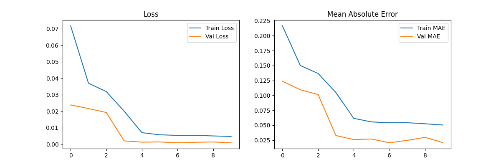

# 🧠 Eye Communicator

**Eye Communicator** is an intelligent gaze-based text entry system designed to help individuals with ALS (Amyotrophic Lateral Sclerosis) and other mobility impairments communicate effectively using only their eye movements.

 <!-- Replace or remove if not relevant -->

---

## 🚀 Features

- 👁️ Real-time gaze tracking via webcam
- 🧠 Deep learning models (CNN + LSTM) for eye movement classification
- ⌨️ On-screen keyboard with gaze-based selection
- 📊 Visual feedback and logging for experiment evaluation

---

## 📁 Project Structure

eye_communicator/
│
├── models/ # Saved trained models (.h5 files)
├── src/ # Source code for model training and inference
│ ├── train_cnn.py
│ ├── train_lstm.py
│ ├── gaze_detection.py
│ └── keyboard_gui.py
├── data/ # [Optional] Raw gaze datasets (excluded in .gitignore)
├── diagram/ # Architecture diagrams (PlantUML)
├── requirements.txt
├── nltk_text_processing.py
├── experiment_log.txt
└── .gitignore


---

## 🛠️ Requirements

- Python 3.8+
- TensorFlow / Keras
- PyTorch
- OpenCV
- Mediapipe
- Numpy, Pandas, etc.

Install dependencies with:

```bash
pip install -r requirements.txt

💡 How It Works
Eye movements are captured via webcam

CNN model classifies gaze direction from images

LSTM processes sequences for temporal classification

GUI keyboard is controlled based on predicted gaze direction

🧪 Dataset
Trained using the GazeBase Dataset(https://www.cs.bham.ac.uk/~eyetracking/GazeBase/) — a large-scale eye movement dataset suitable for machine learning applications.

📦 Setup
Clone this repository:
git clone https://github.com/chahatgupta/eye_communicator.git
cd eye_communicator
(Optional) Create a virtual environment:
python -m venv venv
venv\Scripts\activate  # On Windows
Install dependencies:
pip install -r requirements.txt
Run the main module:
python src/webcam_test.py

📈 Model Training
To retrain the models on GazeBase or your custom dataset:
python src/train_cnn.py     # Train the CNN
python src/train_lstm.py    # Train the LSTM
